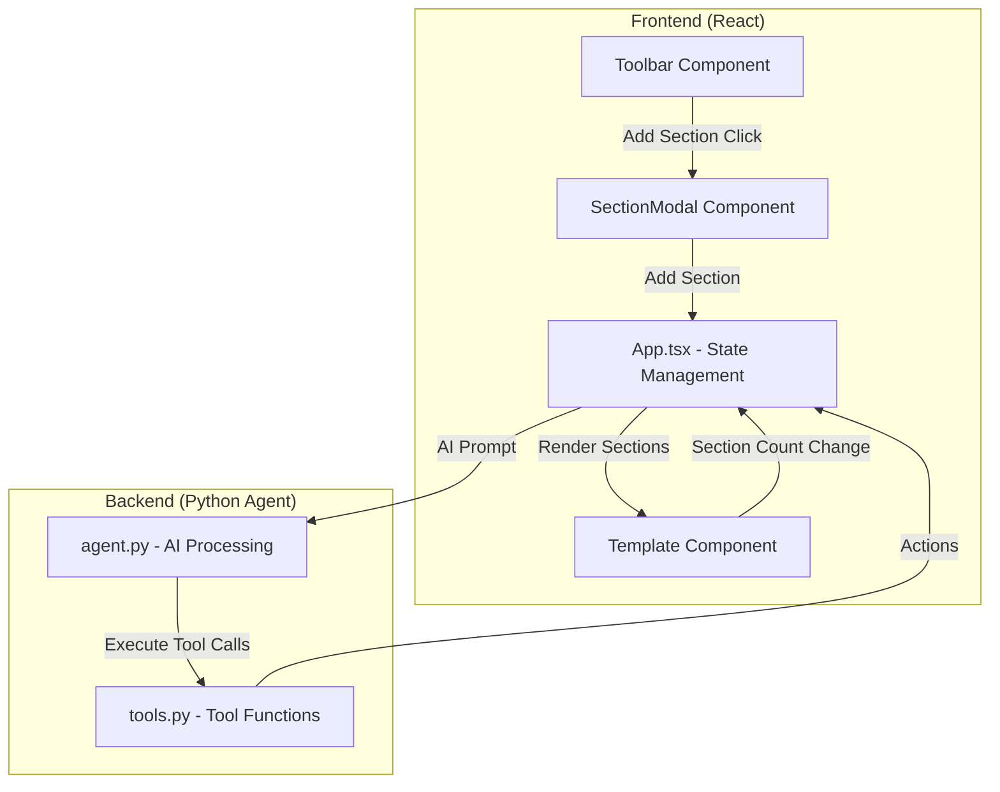

# Dynamic Sections Management Plan

## Overview
Enable dynamic management of CV sections - allowing users and the AI agent to add, remove, and specify which sections to manipulate.

## Architecture



## Current State Analysis

### Existing Section Types
- `summary` - Professional summary (single item)
- `education` - Education entries (multiple items)
- `skills` - Skills categories (single item with groups)
- `certifications` - Certification entries (multiple items)
- `projects` - Project entries (multiple items with bullets)
- `awards` - Award entries (multiple items)
- `volunteering` - Volunteering entries (multiple items)

### Current AI Agent Tools
1. `set_field` - Set a single string field using dot-path
2. `delete_at` - Remove an element from an array using dot-path
3. `append_item` - Append a new object to any array

## Implementation Steps

### 1. Backend: Add New Tools to tools.py

#### Tool: add_section
```python
@tool
def add_section(section_type: str, title: str) -> str:
    """Add a new section to the CV.
    
    section_type: type of section to add - one of:
      summary, education, skills, certifications, projects, awards, volunteering
    
    title: the display title for the section (e.g., "WORK EXPERIENCE")
    
    Note: Only one summary and skills section can exist at a time.
    """
```

#### Tool: delete_section
```python
@tool
def delete_section(section_index: int) -> str:
    """Delete an entire section from the CV by its index.
    
    section_index: the array index of the section to delete (0-based).
    Use sections property to determine the index.
    
    Note: Header cannot be deleted, only sections.
    """
```

### 2. Backend: Update agent.py

- Update system prompt to include section management instructions
- Handle natural language like "add a work experience section" or "remove the awards section"
- Provide appropriate responses when sections are added/removed

### 3. Frontend: Add SectionModal Component

**Location**: `cv-maker/src/components/SectionModal.tsx`

**Features**:
- Modal overlay with form to add new section
- Dropdown to select section type
- Text input for custom section title
- Shows available section types with descriptions
- Cancel and Add buttons

**Section Types with Descriptions**:
| Type | Description |
|------|-------------|
| summary | Professional summary/objective |
| education | Educational background and degrees |
| skills | Technical skills and competencies |
| certifications | Professional certifications |
| projects | Project descriptions with achievements |
| awards | Awards and scholarships |
| volunteering | Volunteer work and leadership |

### 4. Frontend: Add Section Button to Toolbar

**Location**: `cv-maker/src/components/Chat.tsx` (Toolbar component)

- Add "Add Section" button in the toolbar (bottom center)
- Click opens the SectionModal
- Button with icon: `+` symbol or section icon

### 5. Frontend: Section Deletion UI

**Location**: `cv-maker/src/components/Template.tsx`

- Add delete button to each section header (similar to item delete buttons)
- Show confirmation before deleting
- Prevent deletion of last remaining section
- Handle empty state appropriately

### 6. Frontend: Update App.tsx

**Changes**:
- Add state for section modal visibility
- Add handlers for add/delete section operations
- Ensure section operations work with AI agent actions
- Re-render template when sections change

## File Changes Summary

### New Files
1. `cv-maker/src/components/SectionModal.tsx` - Modal for adding sections

### Modified Files
1. `cv-maker-server/tools.py` - Add `add_section` and `delete_section` tools
2. `cv-maker-server/agent.py` - Update prompts for section management
3. `cv-maker/src/components/Chat.tsx` - Add "Add Section" button to Toolbar
4. `cv-maker/src/components/Template.tsx` - Add section deletion UI
5. `cv-maker/src/App.tsx` - Add section state management and modal handlers

## AI Agent Integration

### Natural Language Examples
- "Add a work experience section"
- "Remove the certifications section"
- "Add an awards section titled 'HONORS'"
- "Delete section number 3"

### Tool Usage Pattern
```
User: "Add a work experience section"
Agent: Calls add_section(section_type="education", title="WORK EXPERIENCE")
System: Returns action result
Frontend: Updates CV with new section
```

## Edge Cases
1. Attempting to add duplicate section types (summary, skills) - should replace or warn
2. Deleting all sections - should keep at least one section
3. AI agent tries to delete non-existent section - should return error message
4. Section title conflicts - should allow duplicate titles

## Testing Scenarios
1. User adds section via UI modal
2. User deletes section via delete button
3. AI agent adds section via natural language
4. AI agent deletes section via natural language
5. Verify sections render correctly after add/delete
6. Verify state persists correctly
