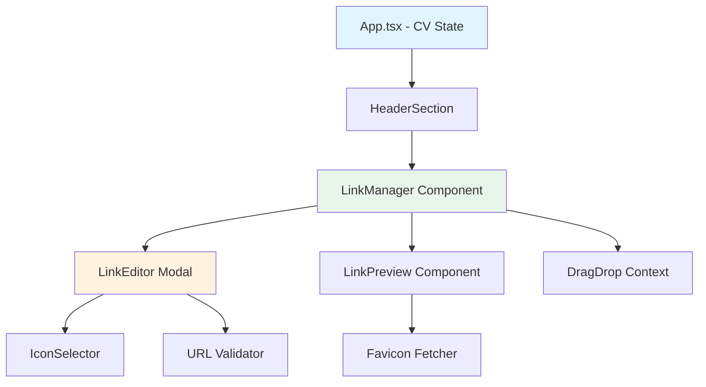

# Link Management Interface Architecture

## Overview
A comprehensive link management system for the CV Maker that allows users to dynamically add, edit, and organize external hyperlinks with customizable iconography.

## Data Flow Architecture



## Component Hierarchy

```
App.tsx
├── HeaderSection
│   ├── EditableText (name, location, phone, email)
   └── LinkManager [NEW]
        ├── LinkDisplay (grid/list view)
        │   └── LinkCard (draggable items)
        ├── LinkEditorModal
        │   ├── URLInput (with validation)
        │   ├── IconSelector
        │   │   ├── PredefinedIcons
        │   │   └── CustomIconUpload
        │   └── ColorPicker
        └── LayoutToggle (grid/list)
```

## Type Definitions

```typescript
// Link Types
interface SocialLink {
  id: string;
  url: string;
  label: string;
  iconType: 'github' | 'linkedin' | 'twitter' | 'globe' | 'custom';
  customIcon?: string; // Base64 or URL
  color?: string;
  displayOrder: number;
}

interface LinkValidationState {
  isValid: boolean;
  error: string | null;
  isChecking: boolean;
}

// Extended CVHeader
interface CVHeader {
  name: string;
  location: string;
  phone: string;
  email: string;
  socialLinks: SocialLink[];
}
```

## Feature Breakdown

### 1. Link Management Core
- **Add Links**: Modal form with URL input, label, icon selection
- **Edit Links**: Inline or modal editing capability
- **Delete Links**: Confirmation-based removal
- **Reorder**: Drag-and-drop functionality with smooth animations

### 2. Icon System
- **Predefined Icons**:
  - GitHub (code repositories)
  - LinkedIn (professional networking)
  - Twitter/X (social media)
  - Globe/World (personal websites)
  - Mail (email)
  - Phone (contact)
  - Portfolio (briefcase)
- **Custom Icons**: Upload support (SVG, PNG)
- **Auto-Detect**: Favicon fetching from URL

### 3. URL Validation
- Real-time validation using URL constructor
- Async domain verification
- Protocol normalization (auto-add https://)
- Error states with visual feedback

### 4. Layout Options
- **Grid View**: Responsive 2-4 column layout
- **List View**: Vertical stack with details
- **Compact View**: Icon-only row (for header)

### 5. Theming & Accessibility
- Light/Dark mode support
- WCAG 2.1 AA compliant contrast ratios
- ARIA labels for all interactive elements
- Keyboard navigation (Tab, Enter, Escape)
- Screen reader announcements

### 6. Visual Features
- Smooth hover transitions (scale, shadow)
- Drag preview during reordering
- Loading states for favicon fetching
- Color customization per link

## File Structure

```
cv-maker/src/
├── components/
│   ├── links/
│   │   ├── LinkManager.tsx       # Main container
│   │   ├── LinkEditor.tsx        # Add/Edit modal
│   │   ├── LinkCard.tsx          # Individual link display
│   │   ├── IconSelector.tsx      # Icon picker component
│   │   ├── LayoutToggle.tsx      # Grid/List toggle
│   │   └── index.ts              # Barrel export
│   └── Template.tsx              # Update to include links
├── types/
│   └── cv.types.ts               # Extend CVHeader type
├── utils/
│   ├── linkValidation.ts         # URL validation logic
│   └── faviconFetcher.ts         # Favicon fetching utility
├── constants/
│   └── icons.ts                  # Predefined icon SVGs
└── index.css                     # Link-specific styles
```

## Integration Points

### HeaderSection Integration
Links will be displayed in the header alongside contact information:

```tsx
<header className="text-center mb-2">
  <h1>{name}</h1>
  <div className="contact-info">
    {location} • {phone} • {email}
  </div>
  <LinkManager links={socialLinks} onChange={updateSocialLinks} />
</header>
```

### State Management
Social links stored in `CVData.header.socialLinks` array:

```typescript
setCv((prev) => ({
  ...prev,
  header: {
    ...prev.header,
    socialLinks: updatedLinks
  }
}));
```

## Animation Specifications

| Interaction | Animation | Duration | Easing |
|-------------|-----------|----------|--------|
| Hover | scale(1.05) + shadow | 200ms | ease-out |
| Drag Start | opacity(0.5) + scale(0.95) | 150ms | ease-in-out |
| Drag End | opacity(1) + scale(1) | 200ms | ease-out |
| Add Link | slideIn + fadeIn | 300ms | ease-out |
| Delete Link | fadeOut + collapse | 250ms | ease-in |
| Reorder | FLIP animation | 300ms | spring(1, 100, 10, 0) |

## Responsive Breakpoints

| Breakpoint | Grid Columns | Layout |
|------------|--------------|--------|
| < 480px | 2 columns | Compact |
| 480-768px | 3 columns | Standard |
| 768-1024px | 4 columns | Expanded |
| > 1024px | Auto-fit | Full |

## Color Scheme Support

```css
/* Light Theme */
--link-bg: #ffffff;
--link-border: #e5e7eb;
--link-text: #374151;
--link-hover: #f3f4f6;
--link-accent: #3b82f6;

/* Dark Theme */
--link-bg-dark: #1f2937;
--link-border-dark: #374151;
--link-text-dark: #e5e7eb;
--link-hover-dark: #374151;
--link-accent-dark: #60a5fa;
```
